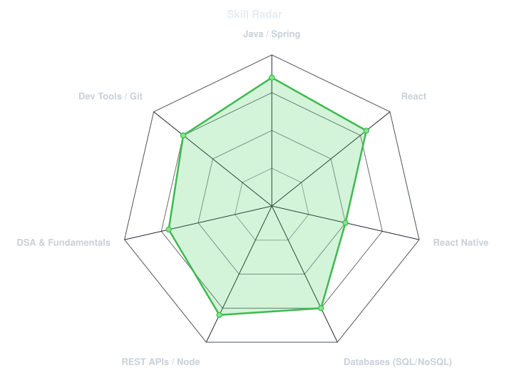
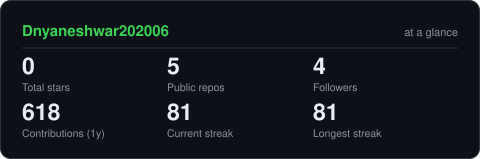
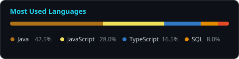
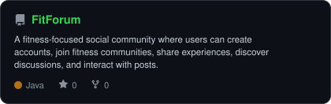
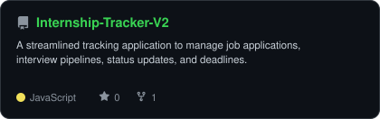

<!-- PORTRAIT - generated by scripts/dotify.py from assets/image.png -->

 

<!-- NAME / TAGLINE - animated typing -->

 

<!-- SOCIALS & PROFILES -->

  

---

## `~/` whoami

`$ cat about.txt`

I’m a software engineer in the making, driven by curiosity, ambitious ideas, and the excitement of turning them into something real. I love building, experimenting with new technologies, and exploring **full-stack development, mobile apps, AI, and intelligent systems**.

- 🔭 Currently building: **[FitForum](https://github.com/Dnyaneshwar202006/FitForum)** and **[Internship-Tracker-V2](https://github.com/Advait-3000/Internship-Tracker-V2)** and working on projects that push me to learn beyond my comfort zone
- 💻 Tech stack: **Java, Spring Boot, React, React Native, Node.js & SQL**
- 📚 Currently learning / exploring: **DSA, system design, full-stack engineering, AI, and software architecture**
- 🎯 Working towards: **Becoming a strong, versatile software engineer capable of building impactful products from idea to scale**
- 💬 Motto: *"Think big. Build boldly. Keep learning."*

 

## `~/` toolbox

---

## `~/` skill radar

<table width="100%">
<tr>
<td width="50%" align="center" valign="middle">

<!-- Self-rated radar - edit assets/skills.json to change it -->
<picture>
  <source media="(prefers-color-scheme: dark)"  srcset="./assets/radar-dark.svg">
  <source media="(prefers-color-scheme: light)" srcset="./assets/radar-light.svg">
  
</picture>

</td>
<td width="50%" align="center" valign="middle">

<!-- Language mix radar - edit assets/languages.json or refreshed by GitHub Actions -->
<picture>
  <source media="(prefers-color-scheme: dark)"  srcset="./assets/radar-langs-dark.svg">
  <source media="(prefers-color-scheme: light)" srcset="./assets/radar-langs-light.svg">
  
</picture>

</td>
</tr>
</table>

---

## `~/` contribution calendar

<!-- 3D isometric calendar, regenerated every 6h by .github/workflows/metrics.yml -->

  

<!-- Snake eats the contribution graph -->
<picture>
  <source media="(prefers-color-scheme: dark)"  srcset="./assets/snake-dark.svg">
  <source media="(prefers-color-scheme: light)" srcset="./assets/snake.svg">
  
</picture>

---

## `~/` leetcode heatmap

<!-- LeetCode Heatmap & Statistics for JhxfOen96k -->

---

## `~/` the numbers

<!-- Self-hosted stats card generated by scripts/cards.py -->
<picture>
  <source media="(prefers-color-scheme: dark)"  srcset="./assets/card-stats-dark.svg">
  <source media="(prefers-color-scheme: light)" srcset="./assets/card-stats-light.svg">
  
</picture>

  

---

## `~/` selected work

<!-- Cards generated by scripts/cards.py from assets/projects.json -->
<table width="100%">
<tr>
<td width="50%" align="center">
  <a href="https://github.com/Dnyaneshwar202006/FitForum">
    <picture>
      <source media="(prefers-color-scheme: dark)"  srcset="./assets/card-FitForum-dark.svg">
      <source media="(prefers-color-scheme: light)" srcset="./assets/card-FitForum-light.svg">
      
    </picture>
  </a>
</td>
<td width="50%" align="center">
  <a href="https://github.com/Advait-3000/Internship-Tracker-V2">
    <picture>
      <source media="(prefers-color-scheme: dark)"  srcset="./assets/card-Internship-Tracker-V2-dark.svg">
      <source media="(prefers-color-scheme: light)" srcset="./assets/card-Internship-Tracker-V2-light.svg">
      
    </picture>
  </a>
</td>
</tr>
</table>

---

`01010100 01101000 01101001 01101110 01101011 00100000 01100010 01101001 01100111 00101110 00100000 01000010 01110101 01101001 01101100 01100100 00100000 01100010 01101111 01101100 01100100 01101100 01111001 00101110`

